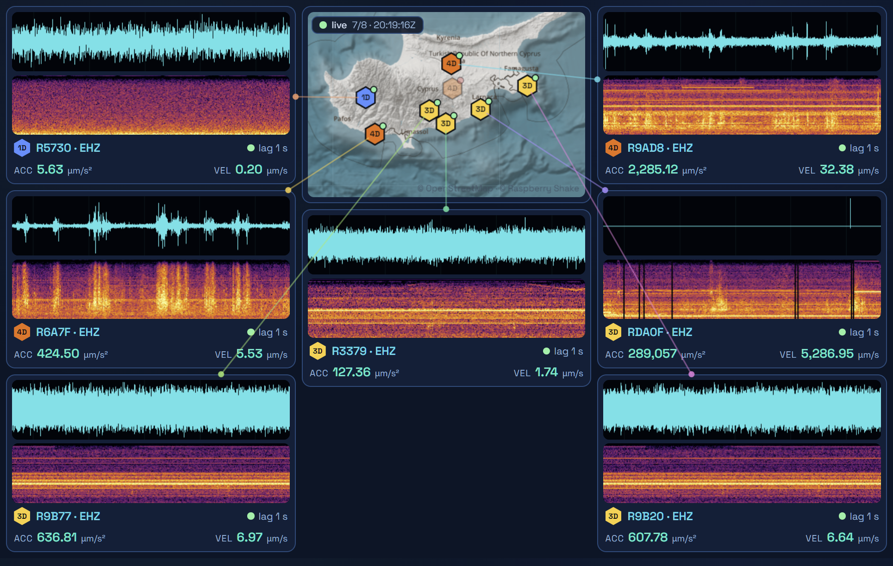

# Thore

Live seismic dashboard for the [Raspberry Shake](https://raspberryshake.org) citizen-science network — waveforms, spectrograms and ground-motion peaks for every public station in a region, streamed with seconds of latency into a tiny [Tauri](https://tauri.app) desktop app.

The default region is Cyprus; point it anywhere with one constant.



## Download

Prebuilt Windows binaries are on the [releases page](https://github.com/arxidaki/thore/releases/latest):

- `thore-vX.Y.Z-windows-x64-portable.exe` — portable, just run it
- `Thore_X.Y.Z_x64-setup.exe` — installer

Both need the WebView2 runtime, which is preinstalled on Windows 10/11. Releases are built automatically by [GitHub Actions](.github/workflows/release.yml) — tagging a commit `vX.Y.Z` and pushing the tag cuts a new one.

## Features

- **Live waveforms** via the CAPS WebSocket stream (the same channel Raspberry Shake's own StationView uses), with automatic fallback to FDSN `dataselect` polling if the stream drops.
- **Per-station spectrogram** (STFT, perceptually-uniform colormap) and **peak acceleration / velocity** in physical units, converted with each channel's published sensitivity.
- **Hand-rolled miniSEED decoder** (Steim-1/2) in dependency-free JavaScript, verified against the per-record reverse-integration checksum.
- **Auto-discovery**: stations are found by bounding box from the FDSN station service. A 5-minute liveness sweep hides sensors with no data (>45 min) and picks up new ones; hidden sensors revive instantly when data returns and stay visible as ghosted markers on the map.
- **Map ↔ card leader lines** with per-station accent colors and hover cross-highlighting.
- **Deterministic fit layout**: masonry columns, whole-UI zoom and stretching graph strips are solved arithmetically so every card stays visible at any window size — made for small always-on windows.
- **Tiny footprint**: ~7 MB portable exe, no bundled browser (uses the system WebView), zero runtime npm dependencies, and a Rust shell that is ~10 lines.

## Build

Prerequisites: [Node.js](https://nodejs.org), [Rust](https://rustup.rs) (stable), and on Windows the MSVC build tools. Windows 11 ships the WebView2 runtime; older systems get it from the installer.

```bash
npm install
npm run dev     # run in development mode
npm run build   # portable exe + NSIS installer
```

Outputs land in `src-tauri/target/release/` (`thore.exe`) and `src-tauri/target/release/bundle/nsis/` (installer). On Windows, `build.cmd` does the same with a double-click.

Developed and tested on Windows; the code has no platform-specific pieces, so Linux/macOS builds should work but are untested.

## Configure the region

Edit the `BBOX` constant at the top of [`renderer/seismo.js`](renderer/seismo.js):

```js
const BBOX = { minLat: 34.3, maxLat: 35.9, minLon: 31.9, maxLon: 34.8 };
```

Every public AM-network station inside the box is discovered, streamed and laid out automatically (cards are ordered west → east to mirror the map).

## Development notes

The whole app is a static web page (`renderer/`) — the Tauri shell only provides the window. That means:

- You can develop and debug the dashboard in a plain browser: serve `renderer/` with any static file server and open `index.html`.
- The data layer is testable from Node without any GUI:

```bash
node lib/fdsn.js                      # station inventory for the region
node lib/fdsn.js --wave R9AD8 EHZ 30  # fetch + decode 30 min of waveforms
node lib/miniseed.js file.mseed       # decode a miniSEED file, verify checksums
```

Architecture, in one paragraph: `renderer/miniseed.js` decodes miniSEED; `renderer/fdsn.js` talks to the FDSN station/dataselect services; `renderer/caps.js` subscribes to the CAPS WebSocket for live records; `renderer/dsp.js` does the FFT/spectrogram/envelope math; `renderer/map.js` renders a static slippy-tile map with hexagon markers; `renderer/seismo.js` owns state, the layout engine and drawing.

## Data sources, etiquette & disclaimers

- Waveforms and metadata come from the **Raspberry Shake** community network (FDSN services at `data.raspberryshake.org`). Live streaming uses the CAPS WebSocket endpoint that Raspberry Shake's public StationView web app runs on, including the client credentials StationView ships to every visitor's browser. **That endpoint is undocumented and may change or disappear without notice** — Thore degrades to FDSN polling automatically if it does. Note the FDSN archive itself trails real time by roughly 30 minutes.
- One WebSocket carries all stations, polling is incremental, and map tiles are fetched once per session — please keep it that way; these are free community services.
- Basemap tiles © [OpenStreetMap](https://www.openstreetmap.org/copyright) contributors, served by Raspberry Shake's map server (CARTO as fallback).
- This project is **not affiliated with Raspberry Shake S.A.** It is a personal dashboard for openly shared citizen-science data. Don't use it for safety-critical decisions.

## License

[MIT](LICENSE)
